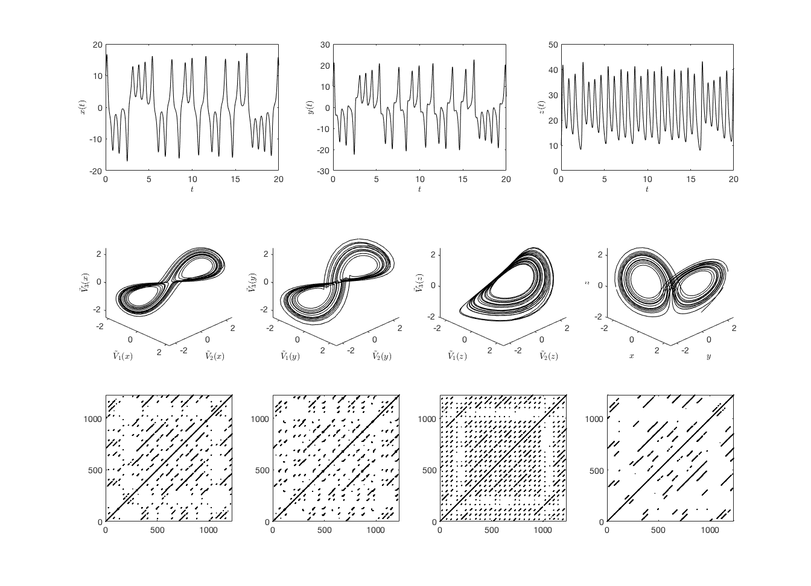

# MdRQA
This repository contains additional resources to the article Wallot, S., Roepstorff, A., & Mønster, D. (2016). Multidimensional Recurrence Quantification Analysis (MdRQA) for the analysis of multidimensional time-series: A software implementation in MATLAB and its application to group-level data in joint action. *Frontiers in psychology*, 7, 1835. DOI:[10.3389/fpsyg.2016.01835](https://doi.org/10.3389/fpsyg.2016.01835).
...and to the article Wallot, S. & Leonardi, G. (2018) Analyzing Multivariate Dynamics Using Cross-Recurrence Quantification Analysis (CRQA), Diagonal-Cross-Recurrence Profiles (DCRP), and Multidimensional Recurrence Quantification Analysis (MdRQA) – A Tutorial in R. Front. Psychol. 9:2232. doi: 10.3389/fpsyg.2018.02232.

## Example output
The figure below shows Figure 3 from the article, showing time series of the *x*, *y* and *z* variables of the Lorenz system (top row), the corresponding phase space embeddings along with
the Lorenz attractor (middle row). The bottom row shows a
comparison of recurrence plots based on unidimensional recurrence quantification analysis (RQA) to multidimensional Recurrence Quantification Analysis (MdRQA).

## Citation
Wallot, S., Roepstorff, A., & Mønster, D. (2016). Multidimensional Recurrence Quantification Analysis (MdRQA) for the analysis of multidimensional time-series: A software implementation in MATLAB and its application to group-level data in joint action. *Frontiers in psychology*, 7, 1835. DOI:[10.3389/fpsyg.2016.01835](https://doi.org/10.3389/fpsyg.2016.01835)
Wallot, S. & Leonardi, G. (2018) Analyzing Multivariate Dynamics Using Cross-Recurrence Quantification Analysis (CRQA), Diagonal-Cross-Recurrence Profiles (DCRP), and Multidimensional Recurrence Quantification Analysis (MdRQA) – A Tutorial in R. Front. Psychol. 9:2232. doi: 10.3389/fpsyg.2018.02232.
